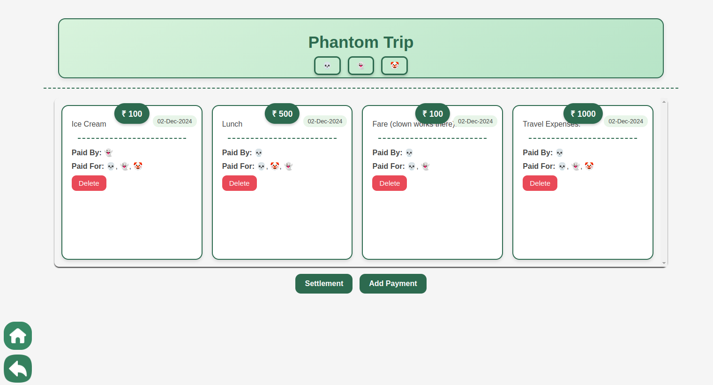

# spliteasy

This is an educational project (submitted as minor project for 
a Bachelor Of Technology Degree program). It utilises a collection
of frontend technologies (web including ReactJS, JS) and backend
technologies (Python3 including flask, json, requests) to create
a simple application where the following purpose is served -

> A group of people can create a list (called listing) and
> then add details of their mutual payments in it over time.
> Finally, they can see a simple settlement recommendation
> for the payments.



## Details about Frontend

The frontend is a static website written in `Javascript`.

The user-interface is written using `ReactJS`and communicates 
with the backend over `http` using `fetchAPI`. `JSON` format
is used for request & response.

*Main frontend author - @prathamagre (for ReactJS)* \
*Secondary frontend author - @SmartyGrasshopper (for backend
interaction and data logic)*

## Details about Backend

The backend is an API written in `Python3` programming language
using the `flask` framework. It communicates with the
frontend using `json` over `http`. Suitable response codes, especially
`400`, `404` and `200` are provided with the return response.

### Storage

Plain `json` files are used for storage of the data. The decision to
use `json` instead of some database was reached as the expected scope and scale
of the project is very very limited. These files are stored with pretty-printing
of indentation 2 so that they are human-readable.

**Important**
Before using the app, add the following folder structure at the 
root of the project -

```plaintext
    data/
      listOfListing.json
      payments.json
```

Then, add the following content to `listOfListings.json` -
```json
{
    "lastListingID": 0,
    "listings": [
    ]
}
```
And the following content to `payments.json` -
```json
{
  
}
```

The original `data` folder was added to `.gitignore` because
it was causing unnecessary tasks while working with the `git`.

### Dependencies

The package dependencies for the backend are listed in `sebackend/requirements.txt`
file. `gunicorn` is required only if one wants to serve using a production WSGI server
on a linux based operating system. Apart from that, the python interpreter is 
a dependency (obviously).

### Serving the backend app

Serve the app from the root folder.

To start a production server with `gunicorn` on a linux based os -
`source startProdServer.sh` on the terminal from root folder.

To start a development server with `flask` on linux based os -
`source testing/startDevServer.sh` on the terminal from root folder.

To start a development server with `flask` on windows -
`testing/startDevServer.bat` on the command prompt from the root folder.

### Known errors and problems

- Don't know why serving with 1 worker on gunicorn hangs with /payment/settlement/
while not with 2 or more workers or the flask-development server. Maybe using requests.get inside
settlement route causes issue or maybe any timeouts since the settlement route does bit more processing
compared to the other routes. Whether requests.get is the issue can be easily tested by removing
the requests and using the actual code of the requested route instead (so there is no requests.get).
- The use of `requests` in settlement route (/payment/settlement/) can cause it to not work on server. In the case this happens, remove the requests (and replace it with required logic of the requested route) and reload the server. Don't know why use of  `requests` causes this issue.

*Main backend and overall technical-design author - @SmartyGrasshopper*